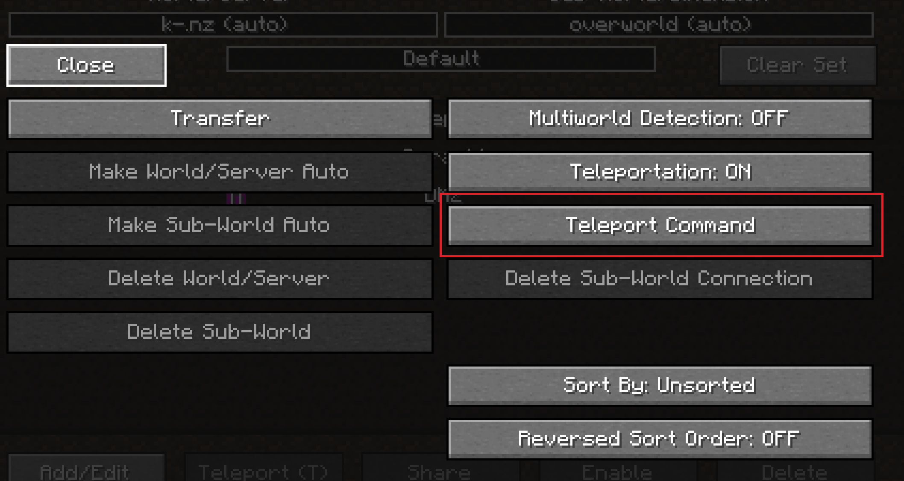

# Teleport guides

Expected to be using Xaero map and minmap (links later)

## Setting up self teleport (without a selector)

1. Bring up your waypoiints menu **Default Key: U**

2. Click on **options**

3. Click on Teleport Command

4. Click on use default: On (will change to Off)

5. update the command to change **@s** to your username (example below)

6. close options

7. Click on a waypoint and **press T**
